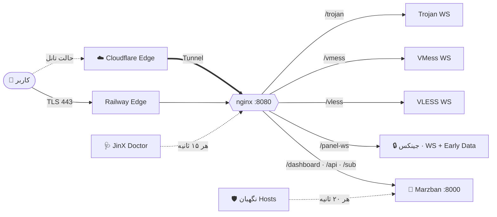

<div align="center">


# ⚡ جینکس | 𝙎𝙪𝙥𝙚𝙧 𝗝𝗶𝗻𝗫


<br/>


<br/>


<br/>

> ### 🚀 ۵ دقیقه · ۰ سرور · ۰ تنظیم دستی · ۱۰۰٪ آماده

<br/>

[**شروع سریع**](#-شروع-سریع) • [**ویژگی‌ها**](#-ویژگیها) • [**معماری**](#-معماری) • [**اپراتورها**](#-همهی-اپراتورها-همراه-اول--ایرانسل--مخابرات--رایتل) • [**تانل ایران**](#-تانل-سرور-ایران-کمترین-پینگ) • [**تانل CF**](#-تانل-کلودفلر) • [**اینباند قفل**](#-اینباند-قفلشده) • [**عیب‌یابی**](#-عیبیابی) • [**سوالات**](#-سوالات-متداول)

</div>

<br/>

---

## 💎 ویژگی‌ها

<table>
<tr>
<td width="50%" valign="top">

### 🔑 ورود تضمینی
بار اول با **`admin / admin`** وارد میشی. بعدش از منوی ☰ پنل گزینه‌ی **تغییر نام کاربری و رمز عبور** رو بزن: یوزر و رمز فعلی رو وارد کن، بعد یوزر و رمز جدید رو. تغییر همون لحظه اعمال میشه، از پنل بیرونت نمی‌کنه، یوزرهات سر جاشون می‌مونن و با Redeploy هم عوض نمیشه.

</td>
<td width="50%" valign="top">

### 🔗 ساب‌لینک آماده
آدرس، SNI، پورت 443 و TLS همه **خودکار** از دامنه‌ی Railway پر میشن. یوزر بساز، لینک رو بده و تمام.

</td>
</tr>
<tr>
<td valign="top">

### 🔒 اینباند ضد دستکاری
اینباند **جینکس | 𝙎𝙪𝙥𝙚𝙧 𝗝𝗶𝗻𝗫** با سه لایه قفل شده و هر تغییری ظرف ۲۰ ثانیه خودبه‌خود برمی‌گرده.

</td>
<td valign="top">

### 🌀 تانل داخلی
Cloudflare Tunnel توی خود کانتینره. با یه متغیر روشن میشه و پینگ رو پایین و ثابت نگه می‌داره.

</td>
</tr>
<tr>
<td valign="top">

### ⚡ تیون‌شده برای سرعت
- WebSocket + **Early Data**، یعنی یه رفت‌وبرگشت کمتر توی هر اتصال
- TCP Fast Open و NoDelay
- بدون بافر
- IPv4 اجباری
- DNS سریع

</td>
<td valign="top">

### 📱 پنل موبایل‌فرندلی و فارسی
فونت **وزیرمتن** داخل خود ایمیج هست، پس حتی اگه گوگل فونت فیلتر باشه هم لود میشه. پنل از اول فارسی و راست‌چین باز میشه. متن‌های قاطی فارسی و انگلیسی درست نمایش داده میشن، اینپوت‌ها توی آیفون دیگه زوم نمی‌کنن و دکمه‌ها هم برای انگشت اندازه‌ان.

</td>
</tr>
<tr>
<td valign="top">

### 💾 بدون پریدن دیتا
دیتابیس، یوزرها و کانفیگ روی Volume ذخیره میشن و با Redeploy هیچی پاک نمیشه.

</td>
<td valign="top">

### 🩺 هلث‌چک واقعی
اگه پنل بالا نیاد، دیپلوی سبز نمیشه. دیگه خبری از «دیپلوی موفق ولی پنل خراب» نیست.

</td>
</tr>
</table>

<br/>

### 🥊 مقایسه

| | 3x-ui روی Railway | پنل‌های معمولی | **⚡ Super JinX** |
|:--|:--:|:--:|:--:|
| بالا اومدن پنل | ❌ اغلب باز نمیشه | ⚠️ | ✅ **همیشه، روی 8080** |
| لاگین | ❌ | ⚠️ با CLI | ✅ **admin / admin + تغییر یوزر و رمز از منو** |
| ساب‌لینک بدون دستکاری | ❌ | ❌ | ✅ |
| اینباند قفل‌شده | ❌ | ❌ | ✅ |
| تانل کلودفلر داخلی | ❌ | ❌ | ✅ |
| هلث‌چک واقعی | ❌ | ❌ | ✅ |
| ربات پشتیبان خودکار | ❌ | ❌ | ✅ |
| صفحه‌ی ساب اختصاصی فارسی | ❌ | ❌ | ✅ |
| بهینه‌سازی سرعت | ❌ | ⚠️ | ✅ |
| پنل موبایل‌فرندلی | ❌ | ❌ | ✅ |

---

## 🧩 معماری



> 🔐 TLS رو خود Railway روی 443 می‌زنه، پس هیچ سرتیفیکیتی لازم نیست و هیچ‌وقت هم منقضی نمیشه.

---

## 🚀 شروع سریع

> [!TIP]
> کل کار ۵ دقیقه‌ست. قدم‌ها رو به ترتیب برو جلو.

- [ ] **۱. ریپو:** همه‌ی فایل‌ها رو توی **ریشه‌ی** یه ریپوی **Private** آپلود کن، نه داخل پوشه.
- [ ] **۲. پروژه:** توی Railway برو به `New Project` ← `Deploy from GitHub repo`.
- [ ] **۳. ریجن:** برو به `Settings` ← `Region` و **🇳🇱 EU West (Amsterdam)** رو انتخاب کن.
- [ ] **۴. Volume:** `Attach Volume` رو بزن و مسیر رو بذار روی `/var/lib/marzban`.
- [ ] **۵. دامنه:** برو به `Settings` ← `Networking` ← `Generate Domain` و پورت رو **`8080`** بذار.
- [ ] **۶. Serverless:** توی `Settings` مطمئن شو **Serverless / App Sleeping خاموشه**، وگرنه سرویس می‌خوابه و کانفیگ‌ها قطع میشن.
- [ ] **۷. Redeploy** 🎉

<div align="center">

| 🌐 پنل | 👤 یوزر | 🔑 پسورد اولیه |
|:--:|:--:|:--:|
| `https://xxxx.up.railway.app/dashboard/` | `admin` | `admin` |

</div>

> [!TIP]
> برای عوض کردن یوزر و رمز، توی پنل منوی **☰** رو باز کن و **تغییر نام کاربری و رمز عبور** رو بزن. اول یوزر و رمز فعلی رو می‌پرسه، بعد یوزر و رمز جدید رو. برای امنیت هم اگه ۵ بار پشت هم رمز فعلی رو اشتباه بزنی، ۵ دقیقه قفل میشه.

> [!NOTE]
> متغیرها **اختیاری‌ان**، چون همه‌شون از قبل توی Dockerfile ست شدن. اگه خواستی، محتوای `variables.env` رو توی `Variables` ← `Raw Editor` پیست کن.

<details>
<summary><b>📋 جدول کامل متغیرها</b></summary>

<br/>

| متغیر | پیش‌فرض | توضیح |
|---|---|---|
| `PORT` | `8080` | پورت پنل، ثابت |
| `UVICORN_HOST` | `127.0.0.1` | پنل فقط از پشت nginx در دسترسه |
| `UVICORN_PORT` | `8000` | پورت داخلی مرزبان |
| `RESET_ADMIN_PASSWORD` | *(خالی)* | رمز یادت رفت؟ بذارش `1` تا رمز برگرده روی `admin`، بعد پاکش کن |
| `XRAY_JSON` | `/var/lib/marzban/xray_config.json` | کانفیگ Xray |
| `SQLALCHEMY_DATABASE_URL` | `sqlite:////var/lib/marzban/db.sqlite3` | دیتابیس |
| `PANEL_DOMAIN` | *(خالی)* | دامنه‌ی شخصی، اختیاری |
| `CF_TUNNEL_TOKEN` | *(خالی)* | توکن تانل کلودفلر |
| `CF_TUNNEL_HOSTNAME` | *(خالی)* | ساب‌دامین تانل |
| `CF_CLEAN_IP` | *(خالی)* | یک یا چند Clean IP کلودفلر، با کاما جدا کن |
| `IRAN_RELAY_IP` | *(خالی)* | آی‌پی سرور ایران (از `iran-relay.sh`) |
| `IRAN_RELAY_PORT` | `443` | پورت سرور ایران |
| `SUB_UPDATE_INTERVAL` | `6` | هر چند ساعت اپ‌ها اشتراک رو خودکار به‌روز کنن |
| `DOCTOR_TG_TOKEN` | *(خالی)* | توکن ربات تلگرام (از BotFather) برای هشدارهای ربات پشتیبان و نمایندگی‌ها |
| `DOCTOR_TG_CHAT` | *(خالی)* | آیدی عددی تلگرامت (هشدارها برای همین آیدی میاد) |
| `TELEGRAM_API_TOKEN` | *(خالی)* | ربات تلگرام خود مرزبان: مدیریت کاربرها از داخل تلگرام (می‌تونه همون توکن بالا نباشه) |
| `TELEGRAM_ADMIN_ID` | *(خالی)* | آیدی عددی ادمین‌های ربات مرزبان، با کاما جدا کن |
| `DISCORD_WEBHOOK_URL` | *(خالی)* | گزارش‌های مرزبان توی دیسکورد، اختیاری |
| `JWT_ACCESS_TOKEN_EXPIRE_MINUTES` | `43200` | لاگین ۳۰ روز معتبره |
| `CF_PORTS` | `443,2053,8443` | پورت‌های کلودفلر برای هر Clean IP (هر اپراتور روی یه پورت سریع‌تره) |
| `JINX_FAST` | `1` | اینباندهای سریع HTTPUpgrade و XHTTP (فقط وقتی نسخه‌ی Xray پشتیبانی کنه). `0` = خاموش |
| `JINX_FRAGMENT` | `10-20,10-20,tlshello` | تنظیمات کانفیگ فرگمنت. اگه خالیش بذاری، این کانفیگ ساخته نمیشه |

</details>

<details>
<summary><b>📁 کار هر فایل</b></summary>

<br/>

| فایل | کارش |
|---|---|
| `Dockerfile` | ایمیج رسمی مرزبان به‌علاوه‌ی nginx و cloudflared |
| `start.sh` | مغز راه‌اندازی: قفل، nginx، تانل، دیتابیس، ادمین، پنل |
| `ensure_admin.py` | 🔑 بار اول admin/admin رو می‌سازه و بعدش به رمز تو دست نمی‌زنه |
| `doctor.py` | 🩺 ربات پشتیبان: خرابی‌ها رو خودکار درست می‌کنه |
| `nginx.conf` · `ws.inc` | روتینگ پورت 8080 و تیونینگ سرعت |
| `jinx.css` | 📱 اسکین ریسپانسیو پنل برای موبایل و دسکتاپ، با فونت وزیرمتن و اصلاحات راست‌چین |
| `jinx.js` | 🌐 پنل از اول فارسی باز میشه. منوی ☰: تغییر نام کاربری و رمز، پنل‌های نمایندگی، اعتبار نمایندگی. لینک گیت‌هاب پنل → x4gpanell |
| `sub.html` | 🎫 صفحه‌ی ساب اختصاصی **JinX Pass**: پاس هولوگرافیک، هسته‌ی مصرف دوحلقه‌ای، پینگ زنده با نمودار، پورتال کانال، داک شناور و ربات JinX Care |
| `jinx_api.py` | 🔐 تغییر یوزر و رمز، پنل‌های نمایندگی با محدودیت‌های سمت سرور، قفل ورود بعد از رمزهای اشتباه، هشدارهای تلگرام، QR |
| `xray_config.json` | اینباندها و بهینه‌سازی‌های Xray |
| `locked_inbound.json` | 🔒 اینباند جینکس |
| `lock.py` | موقع هر استارت اینباند قفل رو برمی‌گردونه |
| `gate.inc` | 🤝 تنظیمات nginx برای محدودیت‌های پنل نمایندگی |
| `enforce_hosts.py` | 🛡 نگهبان Hosts و ساب‌لینک |
| `railway.json` | بیلد و هلث‌چک |
| `iran-relay.sh` | 🇮🇷 اسکریپت تانل سرور ایران (روی VPS ایران اجرا میشه) |
| `variables.env` | متغیرها، اختیاری |

</details>

---

## 🚀 اینباندها و سرعت

| اینباند | ترنسپورت | مسیر |
|---|---|---|
| 🔒 **جینکس \| 𝙎𝙪𝙥𝙚𝙧 𝗝𝗶𝗻𝗫** (قفل) | WebSocket | `/panel-ws` |
| VLESS WS | WebSocket | `/vless` |
| VMESS WS | WebSocket | `/vmess` |
| TROJAN WS | WebSocket | `/trojan` |
| ⚡ VLESS HTTPUPGRADE | HTTPUpgrade (سبک‌تر و سریع‌تر از WS) | `/vhu` |
| ⚡ VLESS XHTTP | XHTTP (پایدار روی اپراتورهای سخت‌گیر) | `/vxh` |

> [!NOTE]
> دو اینباند ⚡ فقط وقتی ساخته میشن که هسته‌ی Xray و مرزبانِ داخل ایمیج ازشون پشتیبانی کنن. این‌طوری هیچ‌وقت هسته از کار نمی‌افته.

هر اینباند برای **همه‌ی مسیرها** کانفیگ میده: 🇮🇷 رله ایران، ☁️ Clean IP روی چند پورت، ☁️ دامنه‌ی تانل، ⚡ مستقیم به هلند و 🧩 فرگمنت. اسم همه‌شون دقیقاً **جینکس \| 𝙎𝙪𝙥𝙚𝙧 𝗝𝗶𝗻𝗫** هست و برنامه با تست پینگ سریع‌ترین رو انتخاب می‌کنه.

> [!IMPORTANT]
> **پینگ ۷۰ تا ۸۰**: با 🇮🇷 رله‌ی ایران یا ☁️ کلودفلر با Clean IP خوب به‌دست میاد. اتصال مستقیم از ایران به Railway هلند معمولاً بالاتره. Region سرویس رو حتماً روی **EU West (Amsterdam)** بذار.

## 🤝 پنل‌های نمایندگی

از منوی ☰ پنل گزینه‌ی **«پنل‌های نمایندگی»** رو بزن. فقط مدیر اصلی این گزینه رو می‌بینه. برای هر نماینده این‌ها رو تعیین می‌کنی:

| تنظیم | توضیح |
|---|---|
| 👤 نام کاربری و رمز | نماینده با همین‌ها وارد **همین پنل** میشه و فقط کاربرهای خودش رو می‌بینه |
| 🏷 نام نمایشی | اسم دلخواه برای شناختن راحت‌تر نماینده (اختیاری) |
| 👥 حداکثر کاربر | حداقل `10`، بیشتر از این نمی‌تونه کاربر بسازه (`0` = نامحدود) |
| 📦 حجم کل قابل فروش | مجموع حجم کاربرهاش از این بیشتر نمیشه. حجم مصرف‌شده‌ی کاربرهای ریست‌شده یا حذف‌شده هم حساب میشه (`0` = نامحدود) |
| ⏳ مدت اعتبار | بعدش نماینده دیگه نمی‌تونه وارد پنل بشه |
| ⏻ فعال / غیرفعال | با غیرفعال کردن، نماینده همون لحظه از پنل خارج میشه |
| ⚡ شارژ و تمدید | افزودن (یا کم کردن) حجم، روز و ظرفیت کاربر در یک مرحله؛ پنل منقضی‌شده از امروز تمدید میشه |
| 🕘 تاریخچه | ساخت، ویرایش، شارژ و کارهای نماینده روی کاربرها (ساخت/حذف/ویرایش/ریست) با تاریخ و ساعت |
| ✏️ تغییر نام و رمز | بعد از ذخیره، اطلاعات ورود جدید برای کپی نمایش داده میشه و نماینده باید دوباره وارد بشه |
| 🔍 جستجو و فیلتر | جستجو بر اساس نام، نام نمایشی یا توضیحات و فیلتر فعال / غیرفعال / منقضی |

نماینده توی منوی خودش گزینه‌ی **«اعتبار پنل نمایندگی»** رو می‌بینه (کاربرها، حجم و تاریخ انقضا). اگه نماینده‌ای رو حذف کنی، کاربرهاش پاک نمیشن و به حساب خودت منتقل میشن.

## 🩺 ربات پشتیبان (JinX Doctor)

یه ربات داخلی که هر **۱۵ ثانیه** همه‌ی اجزای پنل رو چک می‌کنه و اگه چیزی خراب شد، خودش درستش می‌کنه:

| اگه این خراب شه | ربات این کار رو می‌کنه |
|---|---|
| 🌐 nginx | دوباره روشنش می‌کنه |
| ⚙️ کانفیگ‌ها | هر ۱۵ ثانیه پورت‌ها و هر ۶۰ ثانیه یه اتصال واقعی WebSocket به هر کانفیگ رو چک می‌کنه و اگه یکی جواب نده، هسته‌ی Xray رو ری‌استارت می‌کنه |
| 🧠 پنل هنگ کنه (۳ بار پشت هم) | پنل رو می‌بنده و Railway کل سرویس رو تمیز بالا میاره |
| 🔌 Railway پورت دیگه بده | nginx همزمان روی 8080 و اون پورت گوش میده |
| 🧾 کانفیگ Xray خراب شه | نسخه‌ی خراب بکاپ گرفته میشه و از نو ساخته میشه |
| 🌀 تانل قطع شه | خودکار وصل میشه و گزارش میده |
| 🔑 ادمین | ربات‌ها با یه حساب داخلی جدا کار می‌کنن و به رمز تو دست نمی‌زنن |
| 🔗 Hosts | هر ۲۰ ثانیه ساب‌لینک رو درست نگه می‌داره |
| 💾 بکاپ روزانه | هر روز یه نسخه‌ی سالم از دیتابیس پنل (کاربرها و ادمین‌ها) و اطلاعات نماینده‌ها توی `jinx_backups` روی Volume ذخیره میشه، ۷ نسخه‌ی آخر نگه داشته میشه |
| 📄 صفحه‌ی ساب پاک یا دستکاری شه | از نسخه‌ی سالم (golden) خودکار برمی‌گردونه |

### 🔔 هشدارهای تلگرام ربات

با گذاشتن `DOCTOR_TG_TOKEN` و `DOCTOR_TG_CHAT` این هشدارها مستقیم به تلگرامت میاد:

- 🩺 خرابی و تعمیر خودکار nginx، هسته‌ی Xray، پنل و تانل
- 📦 مصرف بیش از ۹۰٪ حجم یه نمایندگی، یا تموم شدن کامل حجمش
- 👥 پر شدن سقف کاربران یه نمایندگی
- ⏳ کمتر از ۳ روز مونده تا انقضای یه نمایندگی، یا منقضی شدنش
- 🔐 ۱۰ رمز اشتباه پشت سر هم (قفل ورود ۵ دقیقه‌ای)

### 🔐 قفل امنیتی ورود
بعد از هر رمز اشتباه، اگه ۵ تلاش یا کمتر باقی مونده باشه، یه هشدار نشون میده که چند تلاش دیگه مونده. با ۱۰ رمز اشتباه، ورود **۵ دقیقه** بسته میشه و یه صفحه‌ی قفل با تم خود پنل باز میشه: شمارش معکوس زنده، ساعت باز شدن و تعداد تلاش‌ها. قفل سمت سرور اجرا میشه، روی IP و نام کاربری. پس با رفرش، مرورگر دیگه یا دستگاه دیگه هم دور زده نمیشه. با یه ورود درست هم شمارنده‌ی اون حساب صفر میشه.

### 🤖 پشتیبان هوشمند داخل صفحه‌ی ساب
خود صفحه‌ی ساب هم یه ربات داره که توی گوشی کاربر کار می‌کنه: صفحه، اطلاعات اشتراک، اینترنت، **سرور و پینگ**، **ساعت گوشی** (VMess با ساعت غلط وصل نمیشه)، کپی و سرویس QR رو چک می‌کنه.
اگه رندر خراب شه خودش دوباره می‌سازه، اگه باز هم نشد **حالت ایمن** میاد تا کانفیگ‌ها همیشه قابل کپی باشن. پینگ ناموفق خودکار ۳ بار تکرار میشه و هر ۲ دقیقه یه بررسی بی‌صدا انجام میده.

<details>
<summary><b>📨 گزارش‌ها رو توی تلگرام بگیر (اختیاری)</b></summary>

<br/>

یه ربات از [@BotFather](https://t.me/BotFather) بساز، بهش یه پیام بده و این دو تا متغیر رو اضافه کن:

```env
DOCTOR_TG_TOKEN=توکن_ربات
DOCTOR_TG_CHAT=آیدی_عددی_خودت
```

</details>

---

## 📡 همه‌ی اپراتورها (همراه اول · ایرانسل · مخابرات · رایتل)

هر اپراتور یه جور فیلتر می‌کنه، برای همین اینباند جینکس **چند تا مسیر** برای یه کانفیگ می‌سازه. توی ساب همه‌شون میان و کلاینت (یا خودت) هر کدوم که روی اپراتورت بهتر بود رو انتخاب می‌کنی:

| کانفیگ توی ساب | مسیر | کی ساخته میشه |
|---|---|---|
| 🇮🇷 **جینکس \| 𝙎𝙪𝙥𝙚𝙧 𝗝𝗶𝗻𝗫 Iran** | سرور ایران، بعد Railway | اگه `IRAN_RELAY_IP` بذاری. **کمترین پینگ** |
| ☁️ **CF 1، CF 2، …** | Clean IPهای کلودفلر، بعد تانل | اگه تانل و `CF_CLEAN_IP` بذاری |
| ☁️ **CF Domain** | دامنه‌ی تانل | اگه تانل بذاری |
| ⚡ **Direct** | مستقیم به Railway | همیشه |
| 🧩 **Fragment** | مستقیم به Railway، با TLS تکه‌تکه | همیشه. برای اپراتورهایی که SNI رو می‌بندن |

> [!TIP]
> اولین کانفیگ لیست همیشه دقیقاً اسم **جینکس | 𝙎𝙪𝙥𝙚𝙧 𝗝𝗶𝗻𝗫** رو داره. توی Hiddify یا v2rayNG تست پینگ گروهی بزن و سریع‌ترین رو انتخاب کن.

> [!NOTE]
> `CF_CLEAN_IP` چند تا آی‌پی رو با کاما قبول می‌کنه (مثلاً یکی برای همراه اول و یکی برای ایرانسل). برای هر آی‌پی یه کانفیگ جدا ساخته میشه.

---

## 🇮🇷 تانل سرور ایران (کمترین پینگ)

اگه یه **VPS ایران** داری، کاربر به سرور داخل ایران وصل میشه و سرور ترافیک رمزشده رو **دست‌نخورده** به Railway می‌فرسته. چیزی رو باز نمی‌کنه و سرتیفیکیت هم نمی‌خواد.

```
📱 کاربر ──► 🇮🇷 VPS ایران :443 ══ TLS passthrough ══► 🇳🇱 Railway
```

روی سرور ایران (Ubuntu یا Debian) این دستور رو بزن:

```bash
sudo bash iran-relay.sh xxxx.up.railway.app
```

اسکریپت این کارها رو خودش انجام میده:
- nginx stream رو نصب می‌کنه
- BBR و TCP Fast Open رو روشن می‌کنه
- آی‌پی سرور رو بهت میگه

بعدش توی Railway متغیر `IRAN_RELAY_IP=آی‌پی_سرور` رو بذار و Redeploy بزن. کانفیگ 🇮🇷 خودش میاد اول لیست.

> چند تا پورت می‌خوای؟ این‌جوری اجراش کن: `RELAY_PORTS="443 8443" sudo -E bash iran-relay.sh xxxx.up.railway.app`

---

## 🌀 تانل کلودفلر

```
📱 کاربر ──► ☁️ Cloudflare (نزدیک ایران) ══ Tunnel ══► 🇳🇱 Railway Amsterdam
```

<details open>
<summary><b>راه‌اندازی تانل در ۴ قدم</b></summary>

<br/>

1. یه دامنه به **Cloudflare** وصل کن.
2. برو به `Zero Trust` ← `Networks` ← `Tunnels` ← `Create a tunnel`، نوع **Cloudflared** رو انتخاب کن و توکن رو کپی کن.
3. توی **Public Hostname** یه ساب‌دامین بساز و Service رو بذار روی `HTTP` ← `127.0.0.1:8080`. حواست باشه HTTP باشه، نه HTTPS.
4. این متغیرها رو توی Railway اضافه کن و Redeploy بزن:

```env
CF_TUNNEL_TOKEN=توکن_تانل
CF_TUNNEL_HOSTNAME=jinx.yourdomain.com
CF_CLEAN_IP=آی‌پی_تمیز (اختیاری)
```

</details>

از این به بعد ساب‌لینک برای **هر مسیر یه کانفیگ** میده. اسم همه‌شون دقیقاً **جینکس \| 𝙎𝙪𝙥𝙚𝙧 𝗝𝗶𝗻𝗫** هست. توی برنامه تست پینگ بگیر و سریع‌ترین رو انتخاب کن. صفحه‌ی ساب هم کنار هر کانفیگ نشون میده از کدوم مسیره:

| مسیر | توضیح |
|---|---|
| 🇮🇷 رله ایران | از سرور ایرانی (کمترین پینگ) |
| ☁️ CDN | از تانل کلودفلر و Clean IP |
| ⚡ مستقیم | مستقیم به Railway، به‌عنوان پشتیبان |
| 🧩 فرگمنت | برای اپراتورهایی که SNI رو فیلتر می‌کنن |

> [!TIP]
> توی حالت تانل، **Clean IP** کار می‌کنه. چند تا رو روی اپراتور خودت تست کن و بهترینش رو بذار توی `CF_CLEAN_IP`.

---

## 🔒 اینباند قفل‌شده

<div align="center">

### 🛡 جینکس | 𝙎𝙪𝙥𝙚𝙧 𝗝𝗶𝗻𝗫
`VLESS` · `WebSocket + Early Data` · `/panel-ws` · `TLS 443`

</div>

| لایه | چی‌کار می‌کنه |
|:--:|---|
| 🧱 **۱** | Core Settings فقط‌خواندنیه و nginx هر درخواست تغییر رو با `403` رد می‌کنه |
| ♻️ **۲** | `lock.py` موقع هر استارت کل کانفیگ Xray رو از روی ریپو از نو می‌سازه. کانفیگ خراب یا قدیمی دیگه معنی نداره |
| 👁 **۳** | `enforce_hosts.py` هر ۲۰ ثانیه اسم، آدرس، SNI و TLS رو چک می‌کنه و اگه دستکاری شده باشه برش می‌گردونه |

---

## 🌍 لوکیشن‌ها

| ریجن | وضعیت |
|---|:--:|
| 🇳🇱 **EU West · Amsterdam** | ⭐ **اصلی** |
| 🇺🇸 US East · Virginia | 🟢 |
| 🇺🇸 US West · California | 🟢 |
| 🇸🇬 Asia Southeast · Singapore | 🟢 |

> برای عوض کردن ریجن فقط `Settings` ← `Region` رو عوض کن. هر ریجن دیگه رو هم میشه به‌صورت **یه سرویس جدا** با همین ریپو بالا آورد.

---

## 📲 کلاینت‌ها

| 🤖 اندروید | 🍎 iOS | 💻 ویندوز / مک |
|:--:|:--:|:--:|
| v2rayNG · Hiddify · NekoBox | Streisand · V2Box · Hiddify | v2rayN · Hiddify · Clash Verge |

> [!IMPORTANT]
> توی کلاینت **Mux رو خاموش** کن و بعد از هر تغییر **Update Subscription** بزن.

---

## 💎 صفحه‌ی حمایت مالی (JinX Donate)

گزینه‌ی **«حمایت مالی / Donation»** داخل منوی ☰ پنل، به‌جای گیت‌هاب مرزبان صفحه‌ی اختصاصی خودمان را در تب جدید باز می‌کند: `https://<دامنه>/donate/`

| بخش | توضیح |
|---|---|
| 🖥 / 📱 | چیدمان جدا برای کامپیوتر و موبایل، تم تیره/روشن (هماهنگ با تم پنل) |
| 🛡 اعتبارسنجی | هر آدرس پیش از نمایش با چک‌سام واقعی شبکه‌اش بررسی می‌شود (EIP-55 · Bech32 · Base58Check · TON CRC16)؛ آدرس خراب **هرگز نمایش داده نمی‌شود** |
| 📋 کپی امن | آدرس کامل (بدون کوتاه‌سازی)، تطبیق آدرس کپی‌شده (ضد بدافزار کلیپ‌بورد)، QR داخلی بدون سرویس خارجی |
| 🤖 JinX Care | دستیار داخل صفحه: شبکه‌ی درست، هشدار شبکه‌ی اشتباه (مثلاً TRC20 برای تتر BEP20)، آموزش Binance / Trust / MetaMask / Tonkeeper / صرافی‌های ایرانی، عیب‌یابی و تعمیر خودکار |
| 🔒 امنیت | بدون هیچ اتصال خارجی، CSP سخت‌گیر، بدون کوکی و ردیابی |

**تغییر آدرس‌ها:** فقط فایل `donate-config.js` را ویرایش کنید (تنها جای آدرس‌ها) و دوباره Deploy کنید.

## 🔗 صفحه‌ی ساب اختصاصی

وقتی لینک ساب توی مرورگر باز بشه، صفحه‌ی اختصاصی و پریمیوم **Super JinX** نمایش داده میشه:

- 💳 **کارت عضویت نورانی** با لبه‌ی نوری چرخان و برق شیشه‌ای، که یوزرنیم، وضعیت، حجم باقی‌مانده و تاریخ اعتبار رو نشون میده
- 📡 **نوار زنده**: وضعیت اتصال (متصل، اخیراً، آفلاین)، **پینگ واقعی** دستگاه تا سرور، و تعداد کانفیگ‌ها
- 📢 **دکمه‌ی «عضویت در کانال»** برجسته، با هاله‌ی نوری، برق متحرک، حلقه‌ی تپنده و حالت‌های Hover و Active
- 📊 مصرف حجم و زمان با نوارهای درخشان، به‌علاوه‌ی حجم کل، تاریخ انقضا (شمسی با اعداد انگلیسی)، نوع ریست و آخرین اتصال
- ⏱ شمارش معکوس زنده‌ی اعتبار، و بنر وضعیت برای حالت‌های منقضی، حجم تمام‌شده، غیرفعال و در انتظار
- 🔗 لینک اشتراک با کپی، QR و اشتراک‌گذاری، آپدیت خودکار هر 6 ساعت، و دکمه‌ی بروزرسانی
- 📲 افزودن با یه کلیک برای **Android، iOS و Windows**
- ⚙️ کانفیگ‌ها **دقیقاً همون‌طور که پنل میده**: به ترتیب، هر کدوم یه ردیف، با کپی و QR جدا، «کپی همه» و **دانلود فایل کانفیگ‌ها**
- ✅ کپی فقط وقتی «کپی شد» نشون میده که واقعاً کپی شده باشه. اگه مرورگر اجازه نده، متن آماده‌ی کپی دستی نمایش داده میشه
- 📱 **همه‌جا نمای موبایل**: روی کامپیوتر هم همون صفحه‌ی گوشی، توی یه قاب شیک وسط صفحه باز میشه
- 🌗 تم تیره و روشن، 🌐 فارسی و انگلیسی
- 🔒 بدون هیچ وابستگی خارجی، و لینک ساب به سایت‌های دیگه نشت نمی‌کنه

> اپ‌ها مثل قبل لینک ساب رو مستقیم می‌خونن. عنوان `Super JinX`، لینک پشتیبانی و آپدیت خودکار هم توی خود اپ‌ها نمایش داده میشن.

---

## 🛠 عیب‌یابی

<details>
<summary><b>😴 کانفیگ‌ها بعد از یه مدت قطع میشن</b></summary>

**Serverless / App Sleeping** رو از `Settings` سرویس خاموش کن.
</details>

<details>
<summary><b>❌ دیپلوی روی Healthcheck فیل میشه</b></summary>

Target Port دامنه باید **`8080`** باشه. هلث‌چک خود پنل رو تست می‌کنه، پس لاگ `alembic` یا `main.py` رو ببین.
</details>

<details>
<summary><b>🔑 رمز یادم رفته یا وارد نمیشم</b></summary>

توی Railway متغیر `RESET_ADMIN_PASSWORD=1` رو اضافه کن و Redeploy بزن. با این کار یوزر و رمز هر دو برمی‌گردن روی `admin / admin`. بعد از ورود، **حتماً متغیر رو پاک کن**، وگرنه با هر Redeploy رمز دوباره ریست میشه. آدرس رو هم دقیقاً با `/dashboard/` باز کن.
</details>

<details>
<summary><b>🌐 زبان پنل رو عوض کنم</b></summary>

از منوی زبان بالای پنل هر زبانی خواستی انتخاب کن (فارسی، English، Русский، 中文). انتخابت ذخیره میشه و فقط بار اول پیش‌فرض فارسیه.
</details>

<details>
<summary><b>🚪 پنل منو انداخت بیرون</b></summary>

درست شده ✅ دیگه با ری‌استارت رمز ریست نمیشه و لاگین **۳۰ روز** معتبره. فقط مطمئن شو Volume وصله، چون بدون Volume با هر Redeploy کلید لاگین عوض میشه.
</details>

<details>
<summary><b>📶 کانفیگ پینگ نمیده</b></summary>

۱. ساب رو **Update** کن تا مسیرهای جدید بیاد.
۲. Mux رو خاموش کن.
۳. توی حالت تانل، Service توی Cloudflare باید `HTTP 127.0.0.1:8080` باشه، نه HTTPS. **WebSockets** هم توی `Network` کلودفلر باید روشن باشه.
۴. یه Clean IP دیگه امتحان کن.
۵. لاگ `[doctor]` رو ببین.
</details>

<details>
<summary><b>🧱 کانفیگ مستقیم اصلاً وصل نمیشه (SNI فیلتره)</b></summary>

کانفیگی که توی صفحه‌ی ساب برچسب **فرگمنت** داره رو امتحان کن، چون از قبل توی ساب هست. فرگمنت توی ساب‌های v2rayNG و Hiddify اعمال میشه. اگه بازم نشد، برو سراغ تانل کلودفلر یا سرور ایران.
</details>

<details>
<summary><b>🌐 توی لاگ <code>domain: NOT SET</code> میاد</b></summary>

`Generate Domain` رو بزن و Redeploy کن.
</details>

<details>
<summary><b>🔗 ساب‌لینک <code>{SERVER_IP}</code> میده</b></summary>

۲۰ ثانیه صبر کن و ساب رو آپدیت کن، نگهبان خودش درستش می‌کنه.
</details>

<details>
<summary><b>💾 بعد از ری‌استارت یوزرها می‌پرن</b></summary>

Volume رو روی `/var/lib/marzban` وصل نکردی.
</details>

<details>
<summary><b>🚫 ذخیره‌ی Core Settings ارور 403 میده</b></summary>

این عمدیه 🔒 برای تغییر اینباندها فایل‌های ریپو رو ادیت کن.
</details>

<details>
<summary><b>📵 وصل میشه ولی چیزی باز نمیشه</b></summary>

Mux رو خاموش کن. توی حالت مستقیم Clean IP نزن، چون Clean IP فقط توی حالت تانل کار می‌کنه.
</details>

---

## ❓ سوالات متداول

<details>
<summary><b>چرا 3x-ui روی Railway بالا نمیاد ولی این میاد؟</b></summary>

چون Railway فقط یه پورت HTTP داره. اینجا nginx همه‌چی رو روی **8080** جمع می‌کنه و پنل هم پشتش روی localhost می‌شینه.
</details>

<details>
<summary><b>پینگ چقدر میشه؟</b></summary>

بستگی به اپراتورت داره. حالت مستقیم به هلند معمولاً بالای ۱۰۰ میشه، و با تانل و یه Clean IP خوب پایین‌تر و ثابت‌تر میاد.
</details>

<details>
<summary><b>میشه چند تا لوکیشن داشت؟</b></summary>

آره. برای هر لوکیشن یه سرویس جدا با همین ریپو بساز.
</details>

---

<div align="center">

### ⭐ اگه به کارت اومد، ستاره بده ⭐

ساخته شده با 💜 بر پایه‌ی [Marzban](https://github.com/Gozargah/Marzban) · AGPL-3.0

<a href="https://t.me/Super_Jinx"></a>

# ⚡ جینکس | 𝙎𝙪𝙥𝙚𝙧 𝗝𝗶𝗻𝗫


</div>
